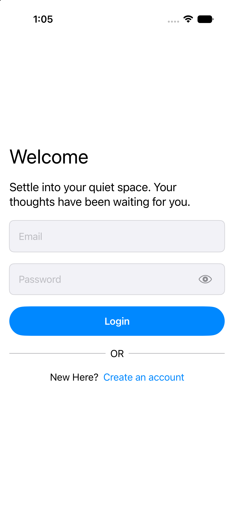
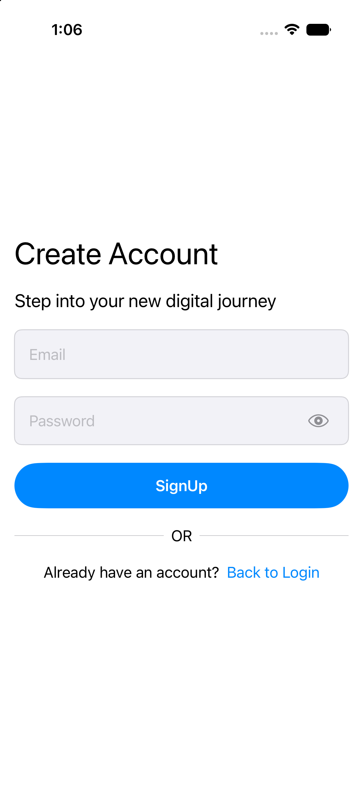
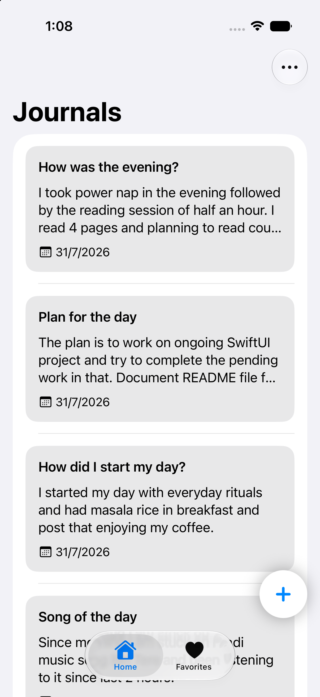
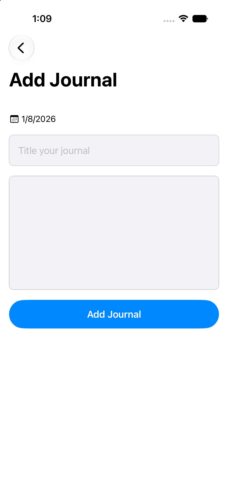
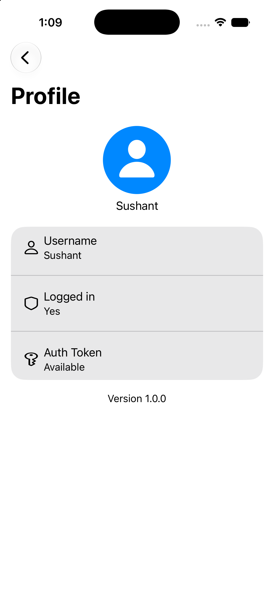

# Journal App (iOS)

## Overview
This is a SwiftUI iOS app for journaling with authentication, a dashboard with tabs, listing journal entries, and adding new entries. Navigation is managed via `NavigationStack` with type-safe routing through an `AppScreen` enum. View models are injected into the environment to manage state and business logic.

## Features
- Email/password login and signup flows (implied `LoginView`, `SignUpView`)
- Dashboard with tabbed navigation (Home, Favorites)
- View list of journal entries
- Add new journal entries with title and content
- Profile screen placeholder in navigation
- Loading states and error alerts
- Persistent session using `AppStorage` for auth token and username

## Architecture
The project follows MVVM with a repository pattern:
- **Views:** `ContentView`, `SplashView`, `LoginView`, `SignUpView`, `DashboardView`, `HomeView`, `FavoritesView`, `AddJournalView`, `ProfileView`
- **View Models:** `AuthViewModel`, `HomeViewModel`, `AddJournalViewModel`
- **Repositories:** `AuthRepositoryImpl`, `HomeRepositoryImpl`, `AddJournalRepositoryImpl` (protocol-driven)
- **Networking:** `NetworkManager` injected as `NetworkServiceProtocol`
- **Navigation:** `NavigationStack` with type-safe `AppScreen` enum
- **State & DI:** Uses `@Environment` for injecting view models and `@AppStorage` for lightweight persistence

## Requirements
- Xcode 27+
- iOS 17+
- Swift 5.10+

## Getting Started
1. Clone the repository.
2. Open the Xcode project/workspace.
3. Select an iOS Simulator (iPhone).
4. Build and run (Cmd+R).

## Configuration
- **AppStorage keys:**  
  - `isLoggedIn` — tracks user login state  
  - `authToken` — stores authentication token  
  - `userName` — stores current username  
- **Network configuration:**  
  `NetworkManager` is used by repositories; configure base URL and endpoints inside the networking layer (`NetworkManager`).

## Project Structure
- **App entry:** `ContentView.swift` with `@main` struct `MyApp`  
- **Navigation:** `AppScreen` enum, `NavigationStack` destinations  
- **Views:** `SplashView`, `LoginView`, `SignUpView`, `DashboardView`, `HomeView`, `FavoritesView`, `AddJournalView`, `ProfileView`  
- **View Models:** `AuthViewModel`, `HomeViewModel`, `AddJournalViewModel`  
- **Models:** `JournalEntry` (identifiable)  
- **Repositories:** `AuthRepository`, `HomeRepository`, `AddJournalRepository` protocols and their implementations  
- **Networking:** `NetworkManager` conforming to `NetworkServiceProtocol`  
- **Mocks:** `MockAuthRepository`, `MockHomeRepositoryImpl`, `MockAddJournalRepository` (for previews and tests)

## Key Workflows
| Login | Sign up |
| --- | --- |
|  |  |

| Home | Add journal |
| --- | --- |
|  |  |

| Profile |  |
| --- | --- |
|  |  |

## Testing
- SwiftUI previews are provided for major views with mock repositories.  
- If using Swift Testing, add tests under a Tests target; example tests can validate view model logic and repository responses.

## Accessibility
- Uses system controls and dynamic type-friendly components by default.  
- It is recommended to add accessibility labels for custom controls such as the add button and eye toggle for password visibility.

## Roadmap 
- Add delete/edit functionality for journal entries  
- Persist journals offline (using SwiftData/Core Data) with sync capabilities  
- Increase unit and UI test coverage  
- Polish theming and dark mode support
